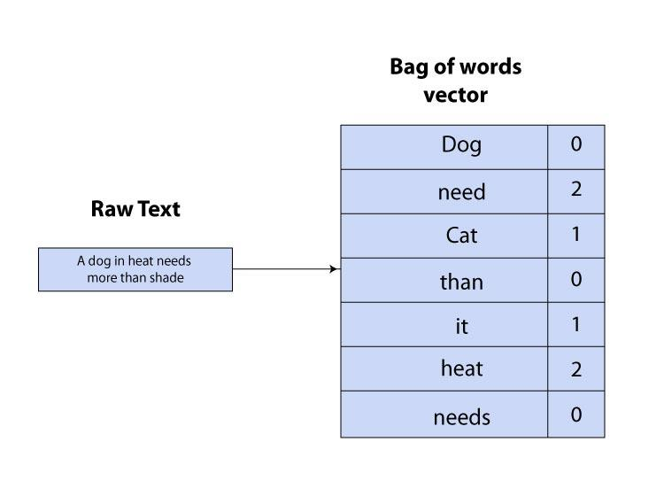
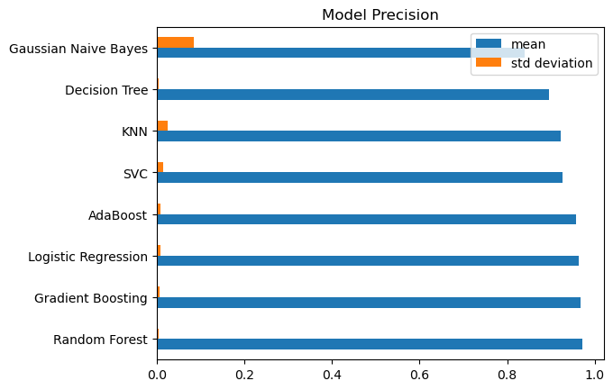
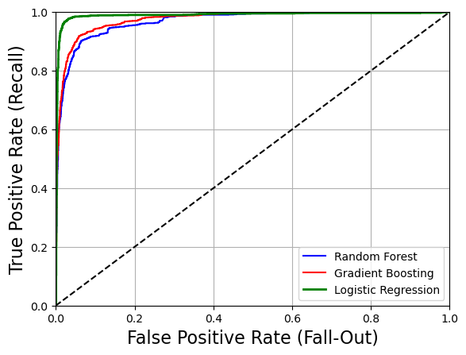

# Overview 
The goal of this project was to build a spam-classification model for email clients. This was an end-of-chapter exercise from Chapter 3 of the book Hands-On Machine Learning (Aurelien), which covered classification tasks. 

Beyond the spam application specifically, this project was an opportunity to implement an end-to-end ML project while utilizing various methods to build and compare different classification models (performance metrics, hyperparameter tuning, ROC AUC curves, etc.).

# Methodology
## Bag-of-Words (BoW) 
I used a Bag-of-Words approach to create a feature vector that the models used for training. Essentially, this involves creating a vocabulary of the most common words found throughout all emails in the corpus ([Apache SpamAssassin](https://spamassassin.apache.org/old/publiccorpus/)). Then, for each email, we count how many instances of each word there are. 

  

## Measuring model performance
To compare several initial models, precision was the performance metric of choice. In the context of spam classification, minimization of false positives is very important. 

  

## Hyperparameter tuning
Once the three highest-precision models (Logistic Regression, Random Forest, Gradient Boosting) were chosen, Grid Search was used to tune hyperparameters. 

# Results
Logistic Regression was ultimately the best-performing model among the top three when considering ROC AUC. Here are final performance metrics on the test set:

Precision: 98%

Recall: 93%

Accuracy: 97%

